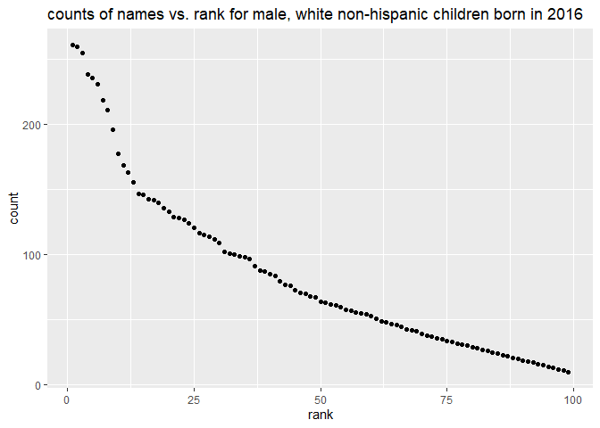

p8105\_hw2\_xz3078
================
Xinyi Zhou

# Problem 1

``` r
Trashwheel = 
  read_excel("./data/Trashwheel.xlsx", sheet = 1, range = "A2:N535") %>%
  janitor::clean_names() %>%
  drop_na(dumpster) %>%
  mutate(sports_balls = round(sports_balls, 0))
Trashwheel
```

    ## # A tibble: 454 x 14
    ##    dumpster month  year date                weight_tons volume_cubic_yards
    ##    <chr>    <chr> <dbl> <dttm>                    <dbl>              <dbl>
    ##  1 1        May    2014 2014-05-16 00:00:00        4.31                 18
    ##  2 2        May    2014 2014-05-16 00:00:00        2.74                 13
    ##  3 3        May    2014 2014-05-16 00:00:00        3.45                 15
    ##  4 4        May    2014 2014-05-17 00:00:00        3.1                  15
    ##  5 5        May    2014 2014-05-17 00:00:00        4.06                 18
    ##  6 6        May    2014 2014-05-20 00:00:00        2.71                 13
    ##  7 7        May    2014 2014-05-21 00:00:00        1.91                  8
    ##  8 8        May    2014 2014-05-28 00:00:00        3.7                  16
    ##  9 9        June   2014 2014-06-05 00:00:00        2.52                 14
    ## 10 10       June   2014 2014-06-11 00:00:00        3.76                 18
    ## # ... with 444 more rows, and 8 more variables: plastic_bottles <dbl>,
    ## #   polystyrene <dbl>, cigarette_butts <dbl>, glass_bottles <dbl>,
    ## #   grocery_bags <dbl>, chip_bags <dbl>, sports_balls <dbl>,
    ## #   homes_powered <dbl>

``` r
Precipitation_2018 = 
  read_excel("./data/Trashwheel.xlsx", sheet = 7, range = "A2:B14") %>%
  janitor::clean_names() %>%
  mutate(year = 2018)

Precipitation_2019 = 
  read_excel("./data/Trashwheel.xlsx", sheet = 6, range = "A2:B14") %>%
  janitor::clean_names() %>%
  mutate(year = 2019)

Precipitation_tidy = 
  bind_rows(Precipitation_2018, Precipitation_2019) %>%
  mutate(month = month.name[as.numeric(month)]) %>%
  select(year, everything())
Precipitation_tidy
```

    ## # A tibble: 24 x 3
    ##     year month     total
    ##    <dbl> <chr>     <dbl>
    ##  1  2018 January    0.94
    ##  2  2018 February   4.8 
    ##  3  2018 March      2.69
    ##  4  2018 April      4.69
    ##  5  2018 May        9.27
    ##  6  2018 June       4.77
    ##  7  2018 July      10.2 
    ##  8  2018 August     6.45
    ##  9  2018 September 10.5 
    ## 10  2018 October    2.12
    ## # ... with 14 more rows

The total number of observations in “Trashwheel” dataset is 454, with
variables dumpster, month, year, date, weight\_tons,
volume\_cubic\_yards, plastic\_bottles, polystyrene, cigarette\_butts,
glass\_bottles, grocery\_bags, chip\_bags, sports\_balls,
homes\_powered. The total number of observation in “Precipitation\_tidy”
dataset is 24, with variables year, month, total precipition.

For available data, the total precipitation in 2018 is 70.33. The median
number of sports balls in a dumpster in 2019 is 9.

# Problem 2

``` r
pols_month = 
  read_csv("./data/fivethirtyeight_datasets/pols-month.csv") %>%
  separate(mon, into = c("year", "month", "day")) %>%
  mutate(month = month.name[as.numeric(month)], 
         year = as.numeric(year),
         president = recode(prez_dem, `0` = "gop", `1` = "dem")) %>%
  select(-day, -prez_dem, -prez_gop)
pols_month
```

    ## # A tibble: 822 x 9
    ##     year month     gov_gop sen_gop rep_gop gov_dem sen_dem rep_dem president
    ##    <dbl> <chr>       <dbl>   <dbl>   <dbl>   <dbl>   <dbl>   <dbl> <chr>    
    ##  1  1947 January        23      51     253      23      45     198 dem      
    ##  2  1947 February       23      51     253      23      45     198 dem      
    ##  3  1947 March          23      51     253      23      45     198 dem      
    ##  4  1947 April          23      51     253      23      45     198 dem      
    ##  5  1947 May            23      51     253      23      45     198 dem      
    ##  6  1947 June           23      51     253      23      45     198 dem      
    ##  7  1947 July           23      51     253      23      45     198 dem      
    ##  8  1947 August         23      51     253      23      45     198 dem      
    ##  9  1947 September      23      51     253      23      45     198 dem      
    ## 10  1947 October        23      51     253      23      45     198 dem      
    ## # ... with 812 more rows

``` r
snp=
  read_csv("./data/fivethirtyeight_datasets/snp.csv") %>%
  mutate(date = mdy(date)) %>%
  separate(date, into = c("year", "month", "day")) %>%
  mutate(month = month.name[as.numeric(month)]) %>%
  mutate(year = as.numeric(year),
    year = ifelse(year > 2021, year - 100, year)) %>%
  select(-day) %>%
  arrange(year, month)
snp
```

    ## # A tibble: 787 x 3
    ##     year month    close
    ##    <dbl> <chr>    <dbl>
    ##  1  1950 April     18.0
    ##  2  1950 August    18.4
    ##  3  1950 December  20.4
    ##  4  1950 February  17.2
    ##  5  1950 January   17.0
    ##  6  1950 July      17.8
    ##  7  1950 June      17.7
    ##  8  1950 March     17.3
    ##  9  1950 May       18.8
    ## 10  1950 November  19.5
    ## # ... with 777 more rows

``` r
unemployment=
  read_csv("./data/fivethirtyeight_datasets/unemployment.csv") %>%
  pivot_longer(
    Jan:Dec,
    names_to = "month", 
    values_to = "percentage") %>%
  mutate(month = match(month,month.abb),
         month = month.name[as.numeric(month)]) %>%
  janitor::clean_names()
unemployment
```

    ## # A tibble: 816 x 3
    ##     year month     percentage
    ##    <dbl> <chr>          <dbl>
    ##  1  1948 January          3.4
    ##  2  1948 February         3.8
    ##  3  1948 March            4  
    ##  4  1948 April            3.9
    ##  5  1948 May              3.5
    ##  6  1948 June             3.6
    ##  7  1948 July             3.6
    ##  8  1948 August           3.9
    ##  9  1948 September        3.8
    ## 10  1948 October          3.7
    ## # ... with 806 more rows

``` r
join_pols_snp = 
  left_join(pols_month, snp, by = c("year", "month"))
join_pols_snp
```

    ## # A tibble: 822 x 10
    ##     year month   gov_gop sen_gop rep_gop gov_dem sen_dem rep_dem president close
    ##    <dbl> <chr>     <dbl>   <dbl>   <dbl>   <dbl>   <dbl>   <dbl> <chr>     <dbl>
    ##  1  1947 January      23      51     253      23      45     198 dem          NA
    ##  2  1947 Februa~      23      51     253      23      45     198 dem          NA
    ##  3  1947 March        23      51     253      23      45     198 dem          NA
    ##  4  1947 April        23      51     253      23      45     198 dem          NA
    ##  5  1947 May          23      51     253      23      45     198 dem          NA
    ##  6  1947 June         23      51     253      23      45     198 dem          NA
    ##  7  1947 July         23      51     253      23      45     198 dem          NA
    ##  8  1947 August       23      51     253      23      45     198 dem          NA
    ##  9  1947 Septem~      23      51     253      23      45     198 dem          NA
    ## 10  1947 October      23      51     253      23      45     198 dem          NA
    ## # ... with 812 more rows

``` r
join_all = 
  left_join(join_pols_snp, unemployment, by = c("year", "month"))
join_all
```

    ## # A tibble: 822 x 11
    ##     year month   gov_gop sen_gop rep_gop gov_dem sen_dem rep_dem president close
    ##    <dbl> <chr>     <dbl>   <dbl>   <dbl>   <dbl>   <dbl>   <dbl> <chr>     <dbl>
    ##  1  1947 January      23      51     253      23      45     198 dem          NA
    ##  2  1947 Februa~      23      51     253      23      45     198 dem          NA
    ##  3  1947 March        23      51     253      23      45     198 dem          NA
    ##  4  1947 April        23      51     253      23      45     198 dem          NA
    ##  5  1947 May          23      51     253      23      45     198 dem          NA
    ##  6  1947 June         23      51     253      23      45     198 dem          NA
    ##  7  1947 July         23      51     253      23      45     198 dem          NA
    ##  8  1947 August       23      51     253      23      45     198 dem          NA
    ##  9  1947 Septem~      23      51     253      23      45     198 dem          NA
    ## 10  1947 October      23      51     253      23      45     198 dem          NA
    ## # ... with 812 more rows, and 1 more variable: percentage <dbl>

In dataset “pols\_month”, there are 822 observations, the range of year
is from 1947 to 2015 with variables year, month, gov\_gop, sen\_gop,
rep\_gop, gov\_dem, sen\_dem, rep\_dem, president. In dataset “snp”,
there are 787 observations, the range of year is from 1950 to 2015 with
variable close which means the closing values of the S&P stock index on
the associated date. In dataset “unemployment”, there are 816
observations, the range of year is from 1948 to 2015 with variables
percentage which means the percentage of unemployment in the associated
month of the associated year.

In the merged dataset “join\_all”, there are 822 observations and 11
columns, the range of year is from 1947 to 2015.

# Problem 3

``` r
names=
  read_csv("./data/Popular_Baby_Names.csv") %>%
  janitor::clean_names() %>%
  mutate(ethnicity = recode(ethnicity, `WHITE NON HISP` = "WHITE NON HISPANIC", `ASIAN AND PACI` = "ASIAN AND PACIFIC ISLANDER", `BLACK NON HISP` = "BLACK NON HISPANIC")) %>%
  distinct()
```

``` r
Olivia = 
  filter(names, childs_first_name == "Olivia") %>%
  select(-gender, -childs_first_name, -count) %>%
  pivot_wider(names_from = "year_of_birth", values_from = "rank")
Olivia
```

    ## # A tibble: 4 x 5
    ##   ethnicity                  `2016` `2015` `2014` `2013`
    ##   <chr>                       <dbl>  <dbl>  <dbl>  <dbl>
    ## 1 ASIAN AND PACIFIC ISLANDER      1      1      1      3
    ## 2 BLACK NON HISPANIC              8      4      8      6
    ## 3 HISPANIC                       13     16     16     22
    ## 4 WHITE NON HISPANIC              1      1      1      1

``` r
male_name = 
  filter(names, gender == "MALE", rank == 1) %>%
  select(-gender, -count, -rank) %>%
  pivot_wider(names_from = "year_of_birth", values_from = "childs_first_name")
male_name
```

    ## # A tibble: 4 x 7
    ##   ethnicity                  `2016` `2015` `2014` `2013` `2012` `2011` 
    ##   <chr>                      <chr>  <chr>  <chr>  <chr>  <chr>  <chr>  
    ## 1 ASIAN AND PACIFIC ISLANDER Ethan  Jayden Jayden Jayden RYAN   ETHAN  
    ## 2 BLACK NON HISPANIC         Noah   Noah   Ethan  Ethan  JAYDEN JAYDEN 
    ## 3 HISPANIC                   Liam   Liam   Liam   Jayden JAYDEN JAYDEN 
    ## 4 WHITE NON HISPANIC         Joseph David  Joseph David  JOSEPH MICHAEL

``` r
male_white_2016 = 
  filter(names, gender == "MALE", ethnicity == "WHITE NON HISPANIC", year_of_birth == 2016)
ggplot(male_white_2016, aes(x = rank, y = count)) + geom_point() + ggtitle("counts of names vs. rank for male, white non-hispanic children born in 2016")
```

<!-- -->
